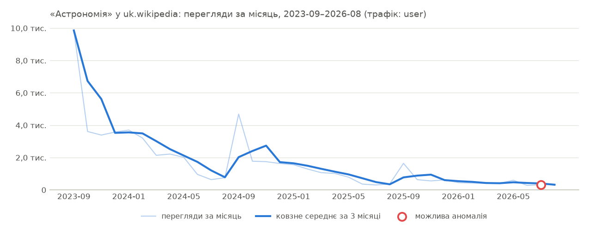

# Звіт ринкової аналітики на основі Вікіпедії

_Тема: Astronomy · Мовний розділ: uk.wikipedia · Період аналізу: з 2023-09 по 2026-08_

## 1. Рекомендація

**Низький пріоритет за цими даними.**

- Виміряне поняття: Astronomy (Wikidata Q333). Ширше чи вужче поняття може дати інший результат.
- Астрономія · uk.wikipedia: лише 6 708 переглядів на рік, замало, щоб судити про тренд.
- Час: увага до Астрономія · uk.wikipedia досягає піку в вересні (3,27× від середнього місяця), тож плануйте запуски й кампанії заздалегідь.
- Для Астрономія · uk.wikipedia динаміка сповільнюється: останні 3 місяці змінилися на −31,9% порівняно з 3 попередніми, після сильніших 3 місяців перед ними.

Основа: лише увага читачів Вікіпедії, а не виручка чи попит на продукт. Це не рішення «так/ні» і не інвестиційна порада: перш ніж виділяти бюджет, перевірте пошукові запити, попит у магазинах застосунків та інтерв'ю з клієнтами.

_Правило: спершу перевірити = щонайменше 12 000 переглядів на рік і зміна рік до року в межах 10% від зміни розділу (з поправкою на розділ) або краще; відкласти = менше 12 000 переглядів на рік або на 25% і більше гірше за розділ; спостерігати = решта._

## 2. Розбивка за показниками

| Показник | Значення | Що це означає |
|---|---|---|
| Попит (перегляди за останні 12 місяців) | 6 708 (559 на місяць) | **дуже малий**. 6 708 переглядів за останні 12 місяців; «дуже малий» означає менше 12 000. Це абсолютна величина: більші мовні розділи мають більше читачів. |
| Зростання (рік до року) | −59,6% | проти −24,6% для всього розділу: на 46,4% гірше |
| Зростання (CAGR за 3 роки) | −44,9% | **спад**. CAGR за 3 роки: −44,9%; «спад» означає менше −3,0% на рік. Для порівняння: весь uk.wikipedia змінився на −24,6% рік до року. |
| Динаміка (останні 3 місяці) | −31,9% проти −5,4% перед тим | **сповільнюється**. Останні 3 місяці −31,9% проти 3 попередніх −5,4% (−26,5 п. п.); понад +5 п. п. означає прискорення, нижче −5 — сповільнення, інакше динаміка стабільна. |
| Сезонність і стабільність | пік — вересень (3,27×), спад — липень | **сильно сезонна**. Пік — вересень: 3,27× від середнього місяця; позначених місяців: 1 із 36, окремих епізодів: 1. Від 1,12× тема помірно сезонна, від 1,30× — сильно сезонна. |
| Локалізація | 9,9 переглядів на мільйон переглядів розділу | не обчислено (Визначено лише для кількох розділів: запустіть `compare` з мовами для порівняння.) |
| Аномалії | позначено: 1 | 2026-07 +130,0%, попередня; причина невідома |
| Якість даних | **ВИСОКА** | повне покриття, надійне зіставлення теми, щонайменше два роки даних |

П'ять окремих сигналів, кожен за одним письмовим правилом. Це докази для рішення людини: їх не зводять в одну оцінку, і вони не є порадою купувати чи інвестувати.

### Ключові спостереження

- Перегляди за рік (2025-09..2026-08) становили 6,7 тис. (приблизно 559 на місяць).
- Перегляди зменшилися на 59,6% рік до року (2025-09..2026-08 проти 2024-09..2025-08).
- CAGR за три роки становив −44,9% (порівняно з 2022-09..2023-08).
- Останні 3 місяці: −31,9% порівняно з попередніми 3 місяцями; імпульс сповільнюється.
- Позначено одну можливу аномалію: +130,0% відносно базового рівня у 2026-07 (причина невідома).

## 3. Визначення теми

| | |
|---|---|
| Канонічна тема | Astronomy |
| Ідентифікатор Wikidata | Q333 |
| Використана стаття | Астрономія (ID сторінки 827) |
| Спосіб зіставлення | точна назва |
| Впевненість зіставлення | 0,98 |
| Відповідники в мовах | uk: Астрономія |
| Пов'язані теми | н/д (недоступно: Команда `analyze` цього не обчислює: запустіть `cluster`, щоб виміряти пов'язані теми.) |

## 4. Попит

| Показник | Значення |
|---|---:|
| Перегляди за рік (останні 12 місяців) | 6 708 |
| Середнє на місяць | 559 |
| Середнє на день | 18,4 |
| Перегляди за вибраний період | 59 386 |
| Унікальні пристрої | н/д (не підтримується: Wikimedia публікує унікальні пристрої лише для всього мовного розділу, а не для окремої статті.) |
| Переглядів на унікальний пристрій | н/д (не підтримується: Wikimedia публікує унікальні пристрої лише для всього мовного розділу, а не для окремої статті.) |

## 5. Зростання

| Показник | Значення |
|---|---:|
| Рік до року (останні 12 міс. проти попередніх 12) | −59,6% |
| CAGR за 3 роки | −44,9% |
| Останні 3 міс. проти попередніх 3 | −31,9% |
| Попередні 3 міс. проти 3 міс. перед ними | −5,4% |
| Прискорення | −26,5 в. п. (сповільнюється) |
| Вибраний період проти попереднього такого самого періоду | −52,9% |

Це історичні вимірювання, а не прогнози. Графік зростання заплановано на наступний етап; тренд видно на графіку в розділі «Попит».

## 6. Сезонність

| Показник | Значення |
|---|---:|
| Місяць піку | Вересень |
| Місяць спаду | Липень |
| Пік / середнє | 3,27 |
| Спад / середнє | 0,26 |
| Волатильність (коефіцієнт варіації) | 1,10 |

Основа: середні значення за календарними місяцями за 2023-09..2026-08 (спостережень на місяць: 3).

## 7. Можливості за мовами

н/д (недоступно: Визначено лише для кількох розділів: запустіть `compare` з мовами для порівняння.)

## 8. Локалізація

| Показник | Значення |
|---|---|
| Проникнення теми у Вікіпедії | 9,9 на мільйон переглядів розділу |
| Спорідненість теми | н/д (недоступно: Визначено лише для кількох розділів: запустіть `compare` з мовами для порівняння.) |
| Розподіл за країнами | н/д (не підтримується: Wikimedia публікує перегляди за країнами лише для всього розділу (top-by-country), а не для статті, тому розподіл теми за країнами виміряти неможливо.) |

Мовний розділ — це не країна: uk.wikipedia читають усюди, де читають цією мовою.

## 9. Екосистема теми

Команда `analyze` цього не обчислює: запустіть `cluster`, щоб виміряти пов'язані теми.

## 10. Аномалії

Місяці, що сильно відхиляються від очікуваного значення. Очікуване = медіана 6 місяців до і 6 після, помножена на звичайний сезонний коефіцієнт цього календарного місяця (з інших років), тож щорічні сезонні піки не позначаються. Позначається, коли робастний z-показник перевищує 3,5, а відхилення становить щонайменше 25,0%. Причини не досліджуються.

| Місяць | Фактично | Очікувано (базовий рівень) | Відхилення від базового рівня | Робастний z | Серйозність |
|---|---:|---:|---:|---:|---|
| 2026-07 | 322 | 140 | +130,0% | 3,7 | висока, попередньо (нещодавній місяць: наступні дані можуть це змінити) |

- Можлива аномалія: у 2026-07 перегляди були на 130,0% вище базового рівня. Причина: невідома.

Рік до року, якщо замінити позначені місяці очікуваними значеннями: −60,7% (показаний рік до року: −59,6%).

## 11. Якість даних

| | |
|---|---|
| Джерело | Wikimedia Analytics API (https://wikimedia.org/api/rest_v1/metrics/pageviews/per-article), access=all-access, agent=user |
| Дані отримано | 2026-09-27T13:33:53+00:00 |
| Звіт створено | 2026-09-27T13:33:53+00:00 (версія програми 0.1.0) |
| Покриття | 100,0% |
| Відсутні дані | немає |
| Впевненість зіставлення теми | 0,98 |
| Дані про унікальні пристрої | ні |
| Дані за країнами | ні |
| Загальний трафік розділу | так |
| Помилки API | немає |
| Рівень якості | **ВИСОКА**: повне покриття, надійне зіставлення теми, щонайменше два роки даних |

Показники, які не обчислено:

| Показник | Статус | Причина |
|---|---|---|
| demand.unique_devices | не підтримується | Wikimedia публікує унікальні пристрої лише для всього мовного розділу, а не для окремої статті. |
| demand.views_per_unique_device | не підтримується | Wikimedia публікує унікальні пристрої лише для всього мовного розділу, а не для окремої статті. |
| localization.country_distribution | не підтримується | Wikimedia публікує перегляди за країнами лише для всього розділу (top-by-country), а не для статті, тому розподіл теми за країнами виміряти неможливо. |
| localization.topic_share | недоступно | Визначено лише для кількох розділів: запустіть `compare` з мовами для порівняння. |
| localization.topic_affinity | недоступно | Визначено лише для кількох розділів: запустіть `compare` з мовами для порівняння. |
| ecosystem.related_topics | недоступно | Команда `analyze` цього не обчислює: запустіть `cluster`, щоб виміряти пов'язані теми. |
| signals.localization | недоступно | Визначено лише для кількох розділів: запустіть `compare` з мовами для порівняння. |

Необроблені відповіді: `data/raw/wikimedia/pageviews-per-article/20260927T133353_076982a3b3e1.json`, `data/raw/wikimedia/pageviews-aggregate/20260927T133353_0f7be670fc9e.json`

## 12. Висновки для бізнесу

### Що дані підтверджують

- Перегляди за рік (2025-09..2026-08) становили 6,7 тис. (приблизно 559 на місяць).
- Перегляди зменшилися на 59,6% рік до року (2025-09..2026-08 проти 2024-09..2025-08).
- CAGR за три роки становив −44,9% (порівняно з 2022-09..2023-08).
- Останні 3 місяці: −31,9% порівняно з попередніми 3 місяцями; імпульс сповільнюється.
- Позначено одну можливу аномалію: +130,0% відносно базового рівня у 2026-07 (причина невідома).
- Ці цифри описують увагу читачів до однієї статті Вікіпедії в розділі uk.wikipedia.

### Чого дані НЕ встановлюють

- Виручку, розмір ринку (TAM) чи готовність платити: перегляди вимірюють увагу, а не купівлі.
- Відповідність продукту ринку чи те, що продукт на цю тему буде успішним.
- Причини змін: дані показують, що трафік змінився, але не чому.
- Попит на рівні країни: читачі uk.wikipedia — це не населення однієї країни.
- Що читачі пов'язаних статей чи інших мовних розділів мають такий самий тренд.

### Питання, які потребують додаткової перевірки

- Чи показує обсяг пошукових запитів (напр., Google Trends) той самий напрям цією мовою?
- Чи є попит у App Store / Google Play на продукти з цієї теми цією мовою?
- Скільки заробляють конкуренти в цій категорії та який розмір доступного ринку?
- Чи готові люди платити? Що показують інтерв'ю з клієнтами та конверсія лендингів?
- Якими будуть вартість залучення клієнта, утримання та монетизація?