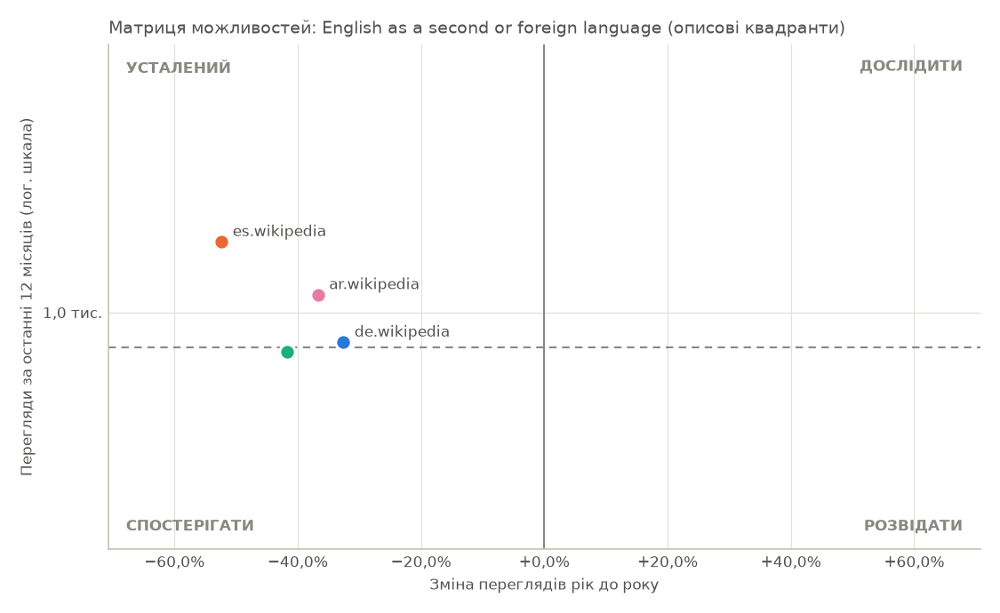
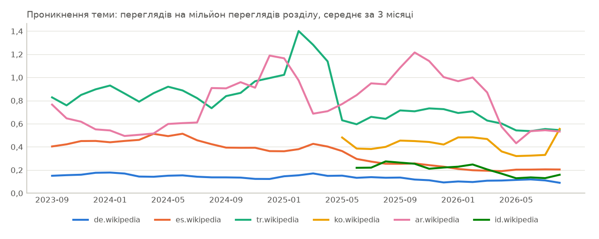

# Звіт порівняння мов: English as a second or foreign language

_Розділи: de.wikipedia, es.wikipedia, tr.wikipedia, ko.wikipedia, ar.wikipedia, id.wikipedia, pl.wikipedia · період з 2023-09 по 2026-08 · створено 2026-09-27T13:34:07+00:00 · джерело: Wikimedia Analytics API_

## 1. Рекомендація

**За увагою читачів жоден варіант поки не виділяється.**

- Виміряне поняття: English as a second or foreign language (Wikidata Q130192). Ширше чи вужче поняття може дати інший результат.
- Жоден варіант не має водночас помітної аудиторії (12 000 переглядів на рік або більше, на рівні медіани або вище) і зміни в межах 10% від зміни розділу. Вважайте всі варіанти недоведеними, доки інші джерела не підтвердять попит.
- Навіть із нішевим порогом 1 000 переглядів на рік жоден варіант не тримається на рівні свого розділу.
- Усі варіанти мають менше 12 000 переглядів на рік: це поняття може бути надто вузьким, щоб виміряти інтерес. Повторний запуск із ширшим поняттям може краще відповісти на запитання.
- Відкласти: es.wikipedia (лише 1 389 переглядів на рік, замало, щоб судити про тренд), ar.wikipedia (лише 1 086 переглядів на рік, замало, щоб судити про тренд), de.wikipedia (лише 871 переглядів на рік, замало, щоб судити про тренд), tr.wikipedia (лише 832 переглядів на рік, замало, щоб судити про тренд) та ще 2.
- У pl.wikipedia немає статті: інтерес там неможливо виміряти переглядами. Сама ця прогалина — висновок (тему не висвітлено цією мовою), але вона не доводить незадоволеного попиту чи «невідкритого ринку» і не є причиною досліджувати цю аудиторію першою. Пошук там знаходить: Understanding by Design, Ortografia, Jednojęzyczny słownik dydaktyczny. Це результати пошуку, а не відповідники: уточніть у користувача, чи це те саме поняття, перш ніж брати його на заміну.

Основа: лише увага читачів Вікіпедії, а не виручка чи попит на продукт. Це не рішення «так/ні» і не інвестиційна порада: перш ніж виділяти бюджет, перевірте пошукові запити, попит у магазинах застосунків та інтерв'ю з клієнтами.

_Правило: спершу перевірити = щонайменше 12 000 переглядів на рік, попит на рівні медіани порівнюваного набору або вище і зміна рік до року в межах 10% від зміни розділу (з поправкою на розділ) або краще; відкласти = менше 12 000 переглядів на рік або на 25% і більше гірше за розділ; спостерігати = решта._

## 2. Розбивка за показниками

- **Попит (перегляди за останні 12 місяців):** de.wikipedia 871 · es.wikipedia 1 389 · tr.wikipedia 832 · ko.wikipedia 309 · ar.wikipedia 1 086 · id.wikipedia 152
- **Зростання (рік до року):** de.wikipedia −32,6% · es.wikipedia −52,3% · tr.wikipedia −41,7% · ko.wikipedia н/д · ar.wikipedia −36,7% · id.wikipedia н/д
- **Зростання (CAGR за 3 роки):** de.wikipedia −18,6% · es.wikipedia −29,0% · tr.wikipedia −19,4% · ko.wikipedia н/д · ar.wikipedia −32,2% · id.wikipedia н/д
- **Динаміка (останні 3 місяці):** сповільнюється: de.wikipedia; стабільний: es.wikipedia; прискорюється: tr.wikipedia, ko.wikipedia, ar.wikipedia, id.wikipedia
- **Спорідненість:** de.wikipedia 0,43 · es.wikipedia 0,88 · tr.wikipedia 2,63 · ko.wikipedia 1,86 · ar.wikipedia 3,30 · id.wikipedia 0,78
- **Сезонність і стабільність:** нестабільна: de.wikipedia, ko.wikipedia; помірно сезонна: es.wikipedia; сильно сезонна: tr.wikipedia, ar.wikipedia; н/д: id.wikipedia
- **Аномалії:** de.wikipedia 3 · es.wikipedia 0 · tr.wikipedia 1 · ko.wikipedia 2 · ar.wikipedia 1 · id.wikipedia 1
- **Якість даних:** ВИСОКА: de.wikipedia, es.wikipedia, tr.wikipedia, ar.wikipedia; НИЗЬКА: ko.wikipedia, id.wikipedia

## 3. Підсумок

- Найбільше переглядів у es.wikipedia: 1,4 тис. за останні 12 місяців (29,9% переглядів теми в порівнюваних розділах).
- Найбільшу частку трафіку свого розділу тема займає в ar.wikipedia: 0,8 переглядів на мільйон.
- Найвища спорідненість теми — у ar.wikipedia: 3,30× середнього по порівнюваних розділах.
- Зміна рік до року — від −52,3% (es.wikipedia) до −32,6% (de.wikipedia).
- Немає статті про це поняття в розділах: pl.wikipedia.

## 4. Визначення теми

| | |
|---|---|
| Канонічна тема | English as a second or foreign language |
| Ідентифікатор Wikidata | Q130192 |
| Спосіб зіставлення | точна назва |
| Впевненість зіставлення | 0,98 |

| Розділ | Стаття | ID сторінки |
|---|---|---:|
| de.wikipedia | Englisch als Zweitsprache | 1752610 |
| es.wikipedia | Inglés como segunda lengua | 9992677 |
| tr.wikipedia | Yabancı dil olarak İngilizce eğitimi | 111135 |
| ko.wikipedia | 제2언어 또는 외국어로서의 영어 | 3274116 |
| ar.wikipedia | الإنجليزية لغة ثانية | 11960 |
| id.wikipedia | Bahasa Inggris sebagai bahasa kedua | 4235486 |
| pl.wikipedia | немає статті |  |

## 5. Можливості за мовами

| Розділ | Перегляди (12 міс.) | Рік до року | CAGR 3 р. | 3 міс. | Унікальні пристрої | Частка теми | Проникнення (на млн) | Спорідненість | Квадрант |
|---|---:|---:|---:|---:|---:|---:|---:|---:|---|
| de.wikipedia | 871 | −32,6% | −18,6% | −21,3% | н/д | 18,8% | 0,1 | 0,43 | усталений |
| es.wikipedia | 1 389 | −52,3% | −29,0% | +0,6% | н/д | 29,9% | 0,2 | 0,88 | усталений |
| tr.wikipedia | 832 | −41,7% | −19,4% | −5,9% | н/д | 17,9% | 0,6 | 2,63 | спостерігати |
| ko.wikipedia | 309 | н/д | н/д | +82,5% | н/д | 6,7% | 0,5 | 1,86 | н/д |
| ar.wikipedia | 1 086 | −36,7% | −32,2% | +26,5% | н/д | 23,4% | 0,8 | 3,30 | усталений |
| id.wikipedia | 152 | н/д | н/д | +16,7% | н/д | 3,3% | 0,2 | 0,78 | н/д |
| pl.wikipedia | немає статті | | | | | | | | |

### Сигнали для ухвалення рішень

П'ять окремих сигналів, кожен за одним письмовим правилом. Це докази для рішення людини: їх не зводять в одну оцінку, і вони не є порадою купувати чи інвестувати.

| Розділ | Розмір ринку (увага читачів) | Зростання | Динаміка | Локалізація | Стабільність |
|---|---|---|---|---|---|
| de.wikipedia | дуже малий | спад | сповільнюється | слабка | нестабільна |
| es.wikipedia | дуже малий | спад | стабільна | помірна | помірно сезонна |
| tr.wikipedia | дуже малий | спад | прискорюється | сильна | сильно сезонна |
| ko.wikipedia | дуже малий | н/д | прискорюється | сильна | нестабільна |
| ar.wikipedia | дуже малий | спад | прискорюється | сильна | сильно сезонна |
| id.wikipedia | дуже малий | н/д | прискорюється | слабка | н/д |

Правила: розмір ринку — за переглядами за останні 12 місяців (дуже малий — менше 12 000, малий — менше 60 000, середній — менше 300 000, великий — менше 1 500 000); зростання — за CAGR за 3 роки (спад — менше −3%, стабільно — менше +3%, зростання — менше +15%); динаміка — за прискоренням ±5 п. п.; локалізація — за спорідненістю (слабка — менше 0,80, сильна — від 1,25); стабільність — за епізодами аномалій, далі за сезонним піком (помірно сезонна — від 1,12×, сильно — від 1,30×). Звіт кожного розділу пояснює свої значення з числами.

## 6. Матриця можливостей

Кожен розділ — точка: по горизонталі історичне зростання (рік до року), по вертикалі абсолютний попит (перегляди за останні 12 місяців, логарифмічна шкала). Межі: зростання вище 0% рік до року; попит на рівні медіани порівнюваних розділів або вище (852 переглядів). Межа відносна до цього набору розділів.

- **дослідити**: зростає, попит вище медіани
- **розвідати**: зростає, попит нижче медіани
- **усталений**: не зростає, попит вище медіани
- **спостерігати**: не зростає, попит нижче медіани

Назви квадрантів — описові мітки, а не інвестиційні рекомендації.

## 7. Локалізація

Проникнення теми: перегляди теми на мільйон переглядів її розділу, помісячно.

- Розподіл за країнами: Wikimedia публікує дані за країнами для розділу, а не для статті, тому для теми їх виміряти неможливо.
- Мовний розділ — це не країна: читачі de.wikipedia живуть у багатьох країнах.
- Мовний розділ — це не країна: читачі es.wikipedia живуть у багатьох країнах.
- Мовний розділ — це не країна: читачі tr.wikipedia живуть у багатьох країнах.
- Мовний розділ — це не країна: читачі ko.wikipedia живуть у багатьох країнах.
- Мовний розділ — це не країна: читачі ar.wikipedia живуть у багатьох країнах.
- Мовний розділ — це не країна: читачі id.wikipedia живуть у багатьох країнах.

## 8. Визначення

- Частка теми: перегляди теми в розділі / перегляди теми в усіх порівнюваних розділах (останні 12 місяців).
- Проникнення теми у Вікіпедії: перегляди теми / усі перегляди розділу (останні 12 місяців), показано на мільйон переглядів. Це не проникнення на ринок.
- Спорідненість теми: (перегляди теми / перегляди розділу) / (те саме для всіх порівнюваних розділів). 1,0 — така сама частка уваги, як у порівнюваному наборі; це власний показник цієї системи, відносний до порівнюваних розділів, а не офіційна метрика Wikimedia.
- Унікальні пристрої: Wikimedia публікує їх лише для всього розділу, а не для статті, тому стовпчик завжди н/д.

## 9. Якість даних

| Розділ | Статус | Покриття | Якість | Аномалії |
|---|---|---:|---|---|
| de.wikipedia | OK | 100,0% | ВИСОКА | 2024-08 +52,6%; 2025-12 −42,9%; 2026-08 −44,9% |
| es.wikipedia | OK | 100,0% | ВИСОКА | 0 |
| tr.wikipedia | OK | 100,0% | ВИСОКА | 2025-02 +132,8% |
| ko.wikipedia | OK | 50,0% | НИЗЬКА | 2025-03 +88,5%; 2026-08 +200,0% |
| ar.wikipedia | OK | 100,0% | ВИСОКА | 2024-12 +124,0% |
| id.wikipedia | OK | 50,0% | НИЗЬКА | 2024-12 −95,2% |
| pl.wikipedia | немає статті | н/д | н/д | н/д |

### Примітки

- Немає статті про це поняття в розділах: pl.wikipedia.

## 10. Висновки для бізнесу

### Що дані підтверджують

- Найбільше переглядів у es.wikipedia: 1,4 тис. за останні 12 місяців (29,9% переглядів теми в порівнюваних розділах).
- Найбільшу частку трафіку свого розділу тема займає в ar.wikipedia: 0,8 переглядів на мільйон.
- Найвища спорідненість теми — у ar.wikipedia: 3,30× середнього по порівнюваних розділах.
- Зміна рік до року — від −52,3% (es.wikipedia) до −32,6% (de.wikipedia).
- Немає статті про це поняття в розділах: pl.wikipedia.

### Чого дані НЕ встановлюють

- Виручку, розмір ринку (TAM) чи готовність платити: перегляди вимірюють увагу, а не купівлі.
- Що порядок розділів відображає привабливість ринку: він відображає лише читання Вікіпедії.
- Причини змін: дані показують, що трафік змінився, але не чому.
- Що читачі пов'язаних статей чи інших мовних розділів мають такий самий тренд.

### Питання, які потребують додаткової перевірки

- Чи показує обсяг пошукових запитів (напр., Google Trends) той самий напрям цією мовою?
- Чи є попит у App Store / Google Play на продукти з цієї теми цією мовою?
- Скільки заробляють конкуренти в цій категорії та який розмір доступного ринку?
- Чи готові люди платити? Що показують інтерв'ю з клієнтами та конверсія лендингів?
- Якими будуть вартість залучення клієнта, утримання та монетизація?