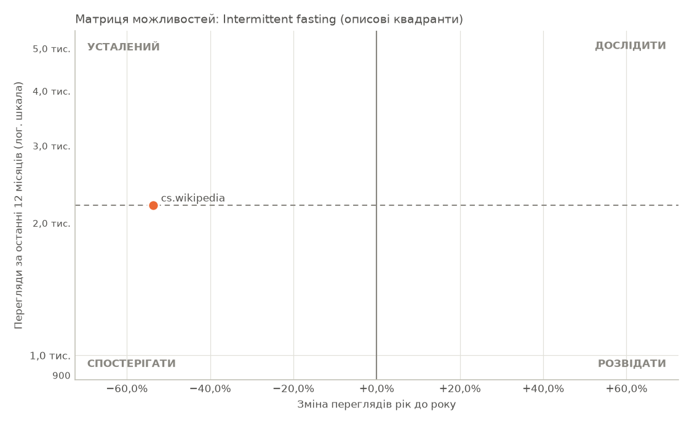
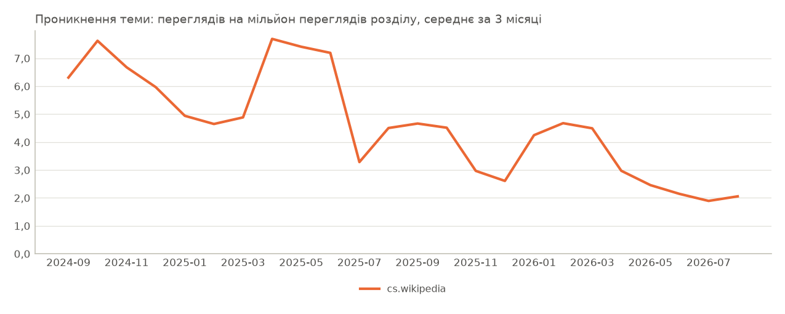

# Звіт порівняння мов: Intermittent fasting

_Розділи: pl.wikipedia, cs.wikipedia · період з 2024-09 по 2026-08 · створено 2026-09-27T13:33:58+00:00 · джерело: Wikimedia Analytics API_

## 1. Рекомендація

**За увагою читачів жоден варіант поки не виділяється.**

- Виміряне поняття: Intermittent fasting (Wikidata Q1666254). Ширше чи вужче поняття може дати інший результат.
- Жоден варіант не має водночас помітної аудиторії (12 000 переглядів на рік або більше, на рівні медіани або вище) і зміни в межах 10% від зміни розділу. Вважайте всі варіанти недоведеними, доки інші джерела не підтвердять попит.
- Навіть із нішевим порогом 1 000 переглядів на рік жоден варіант не тримається на рівні свого розділу.
- Усі варіанти мають менше 12 000 переглядів на рік: це поняття може бути надто вузьким, щоб виміряти інтерес. Повторний запуск із ширшим поняттям може краще відповісти на запитання.
- Відкласти: cs.wikipedia (лише 2 198 переглядів на рік, замало, щоб судити про тренд).
- У pl.wikipedia немає статті: інтерес там неможливо виміряти переглядами. Сама ця прогалина — висновок (тему не висвітлено цією мовою), але вона не доводить незадоволеного попиту чи «невідкритого ринку» і не є причиною досліджувати цю аудиторію першою. Пошук там знаходить: Stres oksydacyjny, Głodówka lecznicza, Paleolityczny styl życia. Це результати пошуку, а не відповідники: уточніть у користувача, чи це те саме поняття, перш ніж брати його на заміну.

Основа: лише увага читачів Вікіпедії, а не виручка чи попит на продукт. Це не рішення «так/ні» і не інвестиційна порада: перш ніж виділяти бюджет, перевірте пошукові запити, попит у магазинах застосунків та інтерв'ю з клієнтами.

_Правило: спершу перевірити = щонайменше 12 000 переглядів на рік, попит на рівні медіани порівнюваного набору або вище і зміна рік до року в межах 10% від зміни розділу (з поправкою на розділ) або краще; відкласти = менше 12 000 переглядів на рік або на 25% і більше гірше за розділ; спостерігати = решта._

## 2. Розбивка за показниками

- **Попит (перегляди за останні 12 місяців):** cs.wikipedia 2 198
- **Зростання (рік до року):** cs.wikipedia −53,6%
- **Зростання (CAGR за 3 роки):** cs.wikipedia −46,1%
- **Динаміка (останні 3 місяці):** прискорюється: cs.wikipedia
- **Спорідненість:** cs.wikipedia 1,00
- **Сезонність і стабільність:** сильно сезонна: cs.wikipedia
- **Аномалії:** cs.wikipedia 0
- **Якість даних:** ВИСОКА: cs.wikipedia

## 3. Підсумок

- Найбільше переглядів у cs.wikipedia: 2,2 тис. за останні 12 місяців (100,0% переглядів теми в порівнюваних розділах).
- Найбільшу частку трафіку свого розділу тема займає в cs.wikipedia: 3,1 переглядів на мільйон.
- Немає статті про це поняття в розділах: pl.wikipedia.

## 4. Визначення теми

| | |
|---|---|
| Канонічна тема | Intermittent fasting |
| Ідентифікатор Wikidata | Q1666254 |
| Спосіб зіставлення | точна назва |
| Впевненість зіставлення | 0,98 |

| Розділ | Стаття | ID сторінки |
|---|---|---:|
| pl.wikipedia | немає статті |  |
| cs.wikipedia | Přerušovaný půst | 1632302 |

## 5. Можливості за мовами

| Розділ | Перегляди (12 міс.) | Рік до року | CAGR 3 р. | 3 міс. | Унікальні пристрої | Частка теми | Проникнення (на млн) | Спорідненість | Квадрант |
|---|---:|---:|---:|---:|---:|---:|---:|---:|---|
| pl.wikipedia | немає статті | | | | | | | | |
| cs.wikipedia | 2 198 | −53,6% | −46,1% | −23,2% | н/д | 100,0% | 3,1 | 1,00 | усталений |

### Сигнали для ухвалення рішень

П'ять окремих сигналів, кожен за одним письмовим правилом. Це докази для рішення людини: їх не зводять в одну оцінку, і вони не є порадою купувати чи інвестувати.

| Розділ | Розмір ринку (увага читачів) | Зростання | Динаміка | Локалізація | Стабільність |
|---|---|---|---|---|---|
| cs.wikipedia | дуже малий | спад | прискорюється | помірна | сильно сезонна |

Правила: розмір ринку — за переглядами за останні 12 місяців (дуже малий — менше 12 000, малий — менше 60 000, середній — менше 300 000, великий — менше 1 500 000); зростання — за CAGR за 3 роки (спад — менше −3%, стабільно — менше +3%, зростання — менше +15%); динаміка — за прискоренням ±5 п. п.; локалізація — за спорідненістю (слабка — менше 0,80, сильна — від 1,25); стабільність — за епізодами аномалій, далі за сезонним піком (помірно сезонна — від 1,12×, сильно — від 1,30×). Звіт кожного розділу пояснює свої значення з числами.

## 6. Матриця можливостей

Кожен розділ — точка: по горизонталі історичне зростання (рік до року), по вертикалі абсолютний попит (перегляди за останні 12 місяців, логарифмічна шкала). Межі: зростання вище 0% рік до року; попит на рівні медіани порівнюваних розділів або вище (2 198 переглядів). Межа відносна до цього набору розділів.

- **дослідити**: зростає, попит вище медіани
- **розвідати**: зростає, попит нижче медіани
- **усталений**: не зростає, попит вище медіани
- **спостерігати**: не зростає, попит нижче медіани

Назви квадрантів — описові мітки, а не інвестиційні рекомендації.

## 7. Локалізація

Проникнення теми: перегляди теми на мільйон переглядів її розділу, помісячно.

- Розподіл за країнами: Wikimedia публікує дані за країнами для розділу, а не для статті, тому для теми їх виміряти неможливо.
- Мовний розділ — це не країна: читачі cs.wikipedia живуть у багатьох країнах.

## 8. Визначення

- Частка теми: перегляди теми в розділі / перегляди теми в усіх порівнюваних розділах (останні 12 місяців).
- Проникнення теми у Вікіпедії: перегляди теми / усі перегляди розділу (останні 12 місяців), показано на мільйон переглядів. Це не проникнення на ринок.
- Спорідненість теми: (перегляди теми / перегляди розділу) / (те саме для всіх порівнюваних розділів). 1,0 — така сама частка уваги, як у порівнюваному наборі; це власний показник цієї системи, відносний до порівнюваних розділів, а не офіційна метрика Wikimedia.
- Унікальні пристрої: Wikimedia публікує їх лише для всього розділу, а не для статті, тому стовпчик завжди н/д.

## 9. Якість даних

| Розділ | Статус | Покриття | Якість | Аномалії |
|---|---|---:|---|---|
| pl.wikipedia | немає статті | н/д | н/д | н/д |
| cs.wikipedia | OK | 100,0% | ВИСОКА | 0 |

### Примітки

- Немає статті про це поняття в розділах: pl.wikipedia.

## 10. Висновки для бізнесу

### Що дані підтверджують

- Найбільше переглядів у cs.wikipedia: 2,2 тис. за останні 12 місяців (100,0% переглядів теми в порівнюваних розділах).
- Найбільшу частку трафіку свого розділу тема займає в cs.wikipedia: 3,1 переглядів на мільйон.
- Немає статті про це поняття в розділах: pl.wikipedia.

### Чого дані НЕ встановлюють

- Виручку, розмір ринку (TAM) чи готовність платити: перегляди вимірюють увагу, а не купівлі.
- Що порядок розділів відображає привабливість ринку: він відображає лише читання Вікіпедії.
- Причини змін: дані показують, що трафік змінився, але не чому.
- Що читачі пов'язаних статей чи інших мовних розділів мають такий самий тренд.

### Питання, які потребують додаткової перевірки

- Чи показує обсяг пошукових запитів (напр., Google Trends) той самий напрям цією мовою?
- Чи є попит у App Store / Google Play на продукти з цієї теми цією мовою?
- Скільки заробляють конкуренти в цій категорії та який розмір доступного ринку?
- Чи готові люди платити? Що показують інтерв'ю з клієнтами та конверсія лендингів?
- Якими будуть вартість залучення клієнта, утримання та монетизація?