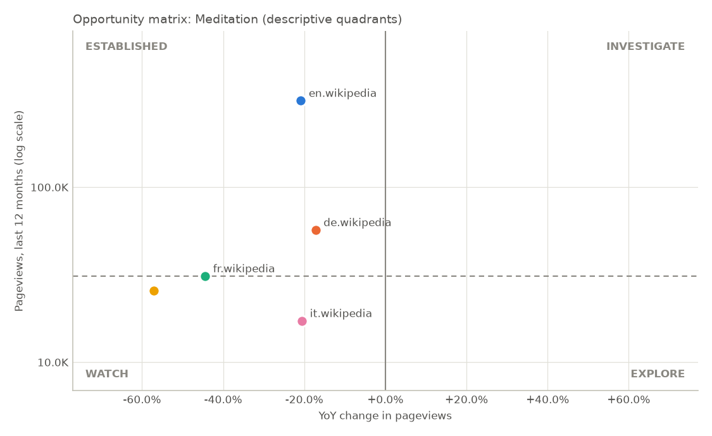
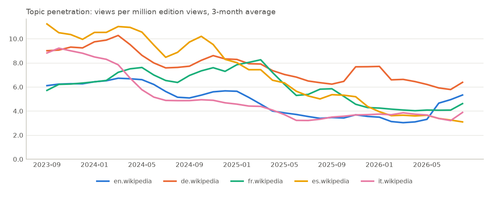

# Language Comparison Report: Meditation

_Editions: en.wikipedia, de.wikipedia, fr.wikipedia, es.wikipedia, it.wikipedia · period 2023-09 to 2026-08 · generated 2026-09-27T13:34:15+00:00 · source: Wikimedia Analytics API_

## 1. Recommendation

**No option stands out on reader attention yet.**

- Concept measured: Meditation (Wikidata Q108458). A broader or narrower concept can give a different result.
- No option has both a sizeable audience (12,000 views a year or more, at or above the median) and a change within 10% of its edition. Treat every option as unproven until other sources confirm demand.
- Even with a niche threshold of 1,000 views a year, no option keeps pace with its edition.
- The largest audience is en.wikipedia: 311,869 views a year, at or above the median of the compared set (31,017); -20.8% year over year, against -7.0% for the whole edition: 14.9% worse than the edition as a whole; affinity 0.94 (this edition gives the topic that many times the average share of attention in the compared set).
- Monitor en.wikipedia: 311,869 views a year, at or above the median of the compared set (31,017); -20.8% year over year, against -7.0% for the whole edition: 14.9% worse than the edition as a whole; affinity 0.94 (this edition gives the topic that many times the average share of attention in the compared set).
- Monitor de.wikipedia: 56,910 views a year, at or above the median of the compared set (31,017); -17.2% year over year, against -7.3% for the whole edition: 10.6% worse than the edition as a whole; affinity 1.64 (this edition gives the topic that many times the average share of attention in the compared set).
- Monitor it.wikipedia: 17,203 views a year, below the median of the compared set (31,017); -20.5% year over year, against -13.0% for the whole edition: 8.7% behind the edition as a whole, within the 10% margin; affinity 0.91 (this edition gives the topic that many times the average share of attention in the compared set).
- Deprioritise: fr.wikipedia (31,017 views a year; -44.4% year over year, against -10.6% for the whole edition: 37.8% worse than the edition as a whole), es.wikipedia (25,633 views a year; -57.1% year over year, against -20.9% for the whole edition: 45.8% worse than the edition as a whole).

Basis: Wikipedia reader attention only, not revenue or product demand. This is not a go/no-go or investment call: before committing budget, confirm with search volume, app-store demand and customer interviews.

_Rule: validate first = at least 12,000 views a year, demand at or above the median of the compared set and a year-over-year change within 10% of the edition's (share-adjusted) or better; deprioritise = under 12,000 views a year, or 25% or more behind the edition; monitor = the rest._

## 2. KPI Breakdown

- **Demand (views, last 12 months):** en.wikipedia 311,869 · de.wikipedia 56,910 · fr.wikipedia 31,017 · es.wikipedia 25,633 · it.wikipedia 17,203
- **Growth (year over year):** en.wikipedia -20.8% · de.wikipedia -17.2% · fr.wikipedia -44.4% · es.wikipedia -57.1% · it.wikipedia -20.5%
- **Growth (3-year CAGR):** en.wikipedia -17.9% · de.wikipedia -15.1% · fr.wikipedia -19.8% · es.wikipedia -39.6% · it.wikipedia -31.4%
- **Momentum (last 3 months):** accelerating: en.wikipedia, de.wikipedia, fr.wikipedia, it.wikipedia; decelerating: es.wikipedia
- **Affinity:** en.wikipedia 0.94 · de.wikipedia 1.64 · fr.wikipedia 1.06 · es.wikipedia 0.96 · it.wikipedia 0.91
- **Seasonality and stability:** moderately seasonal: en.wikipedia, de.wikipedia; highly seasonal: fr.wikipedia, es.wikipedia, it.wikipedia
- **Anomalies:** en.wikipedia 3 · de.wikipedia 2 · fr.wikipedia 0 · es.wikipedia 0 · it.wikipedia 1
- **Data quality:** HIGH: en.wikipedia, de.wikipedia, fr.wikipedia, es.wikipedia, it.wikipedia

## 3. Summary

- en.wikipedia had the most pageviews: 311.9K in the last 12 months (70.5% of the topic's views across the compared editions).
- The topic took the largest share of its edition's traffic in de.wikipedia: 6.7 views per million.
- The highest topic affinity was in de.wikipedia: 1.64× the compared average.
- Year-over-year change ranged from -57.1% (es.wikipedia) to -17.2% (de.wikipedia).

## 4. Topic Definition

| | |
|---|---|
| Canonical topic | Meditation |
| Wikidata ID | Q108458 |
| Resolution method | exact title |
| Resolution confidence | 0.98 |

| Edition | Article | Page ID |
|---|---|---:|
| en.wikipedia | Meditation | 20062 |
| de.wikipedia | Meditation | 28837 |
| fr.wikipedia | Méditation | 1533268 |
| es.wikipedia | Meditación | 72116 |
| it.wikipedia | Meditazione | 16979 |

## 5. Language Opportunity

| Edition | Views (12M) | YoY | 3Y CAGR | 3M | Unique devices | Topic share | Penetration (per M) | Affinity | Quadrant |
|---|---:|---:|---:|---:|---:|---:|---:|---:|---|
| en.wikipedia | 311,869 | -20.8% | -17.9% | +58.4% | n/a | 70.5% | 3.8 | 0.94 | established |
| de.wikipedia | 56,910 | -17.2% | -15.1% | +3.1% | n/a | 12.9% | 6.7 | 1.64 | established |
| fr.wikipedia | 31,017 | -44.4% | -19.8% | +9.5% | n/a | 7.0% | 4.3 | 1.06 | established |
| es.wikipedia | 25,633 | -57.1% | -39.6% | -15.2% | n/a | 5.8% | 3.9 | 0.96 | watch |
| it.wikipedia | 17,203 | -20.5% | -31.4% | +7.9% | n/a | 3.9% | 3.7 | 0.91 | watch |

### Decision signals

Five separate signals, each from one written rule. They are evidence for a human decision: they are not combined into a score and are not a recommendation to buy or invest.

| Edition | Market size (reader attention) | Growth | Momentum | Localization | Stability |
|---|---|---|---|---|---|
| en.wikipedia | high | declining | accelerating | moderate | moderately seasonal |
| de.wikipedia | low | declining | accelerating | strong | moderately seasonal |
| fr.wikipedia | low | declining | accelerating | moderate | highly seasonal |
| es.wikipedia | low | declining | decelerating | moderate | highly seasonal |
| it.wikipedia | low | declining | accelerating | moderate | highly seasonal |

Rules: market size by views in the last 12 months (very low under 12,000, low under 60,000, medium under 300,000, high under 1,500,000); growth by the 3-year CAGR (declining under -3%, stable under +3%, growing under +15%); momentum by ±5 points of acceleration; localization by affinity (weak under 0.80, strong from 1.25); stability by anomaly episodes, then the seasonal peak (moderately seasonal from 1.12x, highly from 1.30x). Each edition's own report explains its readings with the numbers.

## 6. Opportunity Matrix

Each edition is a point: historical growth (YoY) across, absolute demand (views in the last 12 months, log scale) up. Splits: growth above 0% YoY; demand at or above the median of the compared editions (31,017 views). The split is relative to this set of editions.

- **investigate**: growing and above-median demand
- **explore**: growing, below-median demand
- **established**: not growing, above-median demand
- **watch**: not growing, below-median demand

Quadrant names are descriptive labels, not investment recommendations.

## 7. Localization

Topic penetration: the topic's views per million views of its edition, month by month.

- Country distribution: Wikimedia publishes country data per edition, not per article, so it cannot be measured for a topic.
- A language edition is not a country: readers of en.wikipedia live in many countries.
- A language edition is not a country: readers of de.wikipedia live in many countries.
- A language edition is not a country: readers of fr.wikipedia live in many countries.
- A language edition is not a country: readers of es.wikipedia live in many countries.
- A language edition is not a country: readers of it.wikipedia live in many countries.

## 8. Definitions

- Topic share: an edition's topic views / topic views across the compared editions (last 12 months).
- Wikipedia topic penetration: topic views / all views of that edition (last 12 months), shown per million views. Not market penetration.
- Topic affinity: (topic views / edition views) / (topic views / edition views across the compared editions). 1.0 means the same share of attention as the compared set; it is this system's own measure, relative to the editions compared, not an official Wikimedia metric.
- Unique devices: Wikimedia publishes them per edition only, never per article, so the column is always n/a.

## 9. Data Quality

| Edition | Status | Coverage | Quality | Anomalies |
|---|---|---:|---|---|
| en.wikipedia | OK | 100.0% | HIGH | 2026-06 +122.2%; 2026-07 +40.2%; 2026-08 +45.6% |
| de.wikipedia | OK | 100.0% | HIGH | 2025-11 +43.3%; 2026-08 +40.5% |
| fr.wikipedia | OK | 100.0% | HIGH | 0 |
| es.wikipedia | OK | 100.0% | HIGH | 0 |
| it.wikipedia | OK | 100.0% | HIGH | 2026-08 +60.2% |

## 10. Business Implications

### What the data supports

- en.wikipedia had the most pageviews: 311.9K in the last 12 months (70.5% of the topic's views across the compared editions).
- The topic took the largest share of its edition's traffic in de.wikipedia: 6.7 views per million.
- The highest topic affinity was in de.wikipedia: 1.64× the compared average.
- Year-over-year change ranged from -57.1% (es.wikipedia) to -17.2% (de.wikipedia).

### What the data does NOT establish

- Revenue, market size (TAM) or willingness to pay: pageviews measure attention, not purchasing.
- That the order of editions reflects market attractiveness: it reflects Wikipedia reading only.
- Causes of any change: the data shows that traffic moved, not why.
- That readers of related articles, or of other language editions, share this trend.

### Questions requiring further validation

- Does search volume (e.g. Google Trends) show the same direction in this language?
- Is there App Store / Google Play demand for products on this topic in this language?
- What do competitors in this category earn, and how large is the addressable market?
- Will people pay? What do customer interviews and landing-page conversion rates show?
- What would customer acquisition cost, retention and monetization look like?