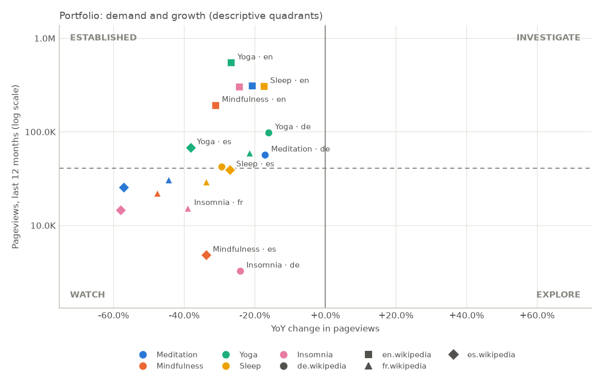

# Portfolio Report: wellness

_Topics: meditation, Mindfulness, yoga, sleep, insomnia · editions: de.wikipedia, en.wikipedia, fr.wikipedia, es.wikipedia · period 2023-09 to 2026-08 · generated 2026-09-27T13:34:30+00:00 · source: Wikimedia Analytics API_

## 1. Recommendation

**Validate Yoga · de.wikipedia first.**

- Yoga · de.wikipedia: 98,454 views a year, at or above the median of the compared set (41,038); -16.1% year over year, against -7.3% for the whole edition: 9.4% behind the edition as a whole, within the 10% margin; affinity 1.55 (this edition gives the topic that many times the average share of attention in the compared set).
- Monitor: Yoga · en.wikipedia, Meditation · en.wikipedia, Sleep · en.wikipedia, Insomnia · en.wikipedia, Yoga · es.wikipedia and 5 more.
- Deprioritise: Mindfulness · en.wikipedia (193,075 views a year; -31.2% year over year, against -7.0% for the whole edition: 26.0% worse than the edition as a whole), Meditation · fr.wikipedia (31,017 views a year; -44.4% year over year, against -10.6% for the whole edition: 37.8% worse than the edition as a whole), Sleep · fr.wikipedia (29,299 views a year; -33.8% year over year, against -10.6% for the whole edition: 26.0% worse than the edition as a whole), Meditation · es.wikipedia (25,633 views a year; -57.1% year over year, against -20.9% for the whole edition: 45.8% worse than the edition as a whole) and 5 more.
- Timing: attention to Yoga · de.wikipedia peaks in January (1.30× the average month), so plan launches and campaigns ahead of it.
- For Yoga · de.wikipedia, momentum is accelerating: the last 3 months changed -0.0% on the 3 before, after a weaker 3 months before that.

Basis: Wikipedia reader attention only, not revenue or product demand. This is not a go/no-go or investment call: before committing budget, confirm with search volume, app-store demand and customer interviews.

_Rule: validate first = at least 12,000 views a year, demand at or above the median of the compared set and a year-over-year change within 10% of the edition's (share-adjusted) or better; deprioritise = under 12,000 views a year, or 25% or more behind the edition; monitor = the rest._

## 2. KPI Breakdown

- **Demand (views, last 12 months):** from 3,273 (Insomnia · de.wikipedia) to 548,597 (Yoga · en.wikipedia)
- **Growth (year over year):** from -58.0% (Insomnia · es.wikipedia) to -16.1% (Yoga · de.wikipedia)
- **Growth (3-year CAGR):** from -39.6% (Meditation · es.wikipedia) to -7.9% (Insomnia · fr.wikipedia)
- **Momentum (last 3 months):** accelerating: 10; decelerating: 5; stable: 5
- **Affinity:** from 0.12 (Insomnia · de.wikipedia) to 1.63 (Meditation · de.wikipedia)
- **Seasonality and stability:** moderately seasonal: 13; highly seasonal: 6; n/a: 1
- **Anomalies:** from 0 (Meditation · fr.wikipedia) to 3 (Meditation · en.wikipedia)
- **Data quality:** HIGH: 19; LOW: 1

## 3. Summary

- 20 topic and edition pairs are shown, across 5 topics and 4 editions.
- Yoga · en.wikipedia had the most pageviews: 548,597 in the last 12 months.
- Every shown pair with a year-over-year figure (19) declined year over year.

## 4. Portfolio Matrix

One row per topic and edition, in the order given. Share and affinity are measured within each topic, across these editions. Rows are not sorted by any KPI, because that order would read as a ranking.

| Topic | Category | Edition | Views (12M) | YoY | 3Y CAGR | 3M | Momentum | Affinity | Quadrant |
|---|---|---|---:|---:|---:|---:|---|---:|---|
| Meditation | mindfulness | de.wikipedia | 56,910 | -17.2% | -15.1% | +3.1% | accelerating | 1.63 | established |
| Meditation | mindfulness | en.wikipedia | 311,869 | -20.8% | -17.9% | +58.4% | accelerating | 0.93 | established |
| Meditation | mindfulness | fr.wikipedia | 31,017 | -44.4% | -19.8% | +9.5% | accelerating | 1.06 | watch |
| Meditation | mindfulness | es.wikipedia | 25,633 | -57.1% | -39.6% | -15.2% | decelerating | 0.95 | watch |
| Mindfulness | mindfulness | de.wikipedia | 33,406 | n/a | n/a | -24.8% | decelerating | 1.61 | n/a |
| Mindfulness | mindfulness | en.wikipedia | 193,075 | -31.2% | -13.0% | -4.4% | stable | 0.97 | established |
| Mindfulness | mindfulness | fr.wikipedia | 22,274 | -47.7% | -17.5% | -3.5% | stable | 1.27 | watch |
| Mindfulness | mindfulness | es.wikipedia | 4,835 | -33.7% | -29.1% | -12.3% | stable | 0.30 | watch |
| Yoga | movement | de.wikipedia | 98,454 | -16.1% | -17.3% | -0.0% | accelerating | 1.55 | established |
| Yoga | movement | en.wikipedia | 548,597 | -26.7% | -22.0% | +30.0% | accelerating | 0.90 | established |
| Yoga | movement | fr.wikipedia | 59,990 | -21.6% | -19.7% | -3.3% | accelerating | 1.12 | established |
| Yoga | movement | es.wikipedia | 68,166 | -38.2% | -28.1% | -13.6% | stable | 1.39 | established |
| Sleep | sleep | de.wikipedia | 42,595 | -29.3% | -17.8% | -5.4% | stable | 1.24 | established |
| Sleep | sleep | en.wikipedia | 307,195 | -17.5% | -11.0% | -10.4% | decelerating | 0.93 | established |
| Sleep | sleep | fr.wikipedia | 29,299 | -33.8% | -20.4% | -24.3% | decelerating | 1.01 | watch |
| Sleep | sleep | es.wikipedia | 39,482 | -27.1% | -19.4% | -8.7% | decelerating | 1.49 | watch |
| Insomnia | sleep | de.wikipedia | 3,273 | -24.2% | -8.9% | -0.8% | accelerating | 0.12 | watch |
| Insomnia | sleep | en.wikipedia | 303,740 | -24.5% | -12.1% | -3.3% | accelerating | 1.15 | established |
| Insomnia | sleep | fr.wikipedia | 15,279 | -39.0% | -7.9% | -11.7% | accelerating | 0.66 | watch |
| Insomnia | sleep | es.wikipedia | 14,667 | -58.0% | -26.9% | +2.7% | accelerating | 0.69 | watch |

Quadrant split: growth above 0% year over year; demand at or above the median of all measured pairs (41,038 views), taken before filters.

- **investigate**: growing and above-median demand
- **explore**: growing, below-median demand
- **established**: not growing, above-median demand
- **watch**: not growing, below-median demand

Quadrant names are descriptive labels, not investment recommendations.

## 5. Decision Signals

Five separate signals, each from one written rule. They are evidence for a human decision: they are not combined into a score and are not a recommendation to buy or invest.

| Topic | Edition | Market size (reader attention) | Growth | Momentum | Localization | Stability |
|---|---|---|---|---|---|---|
| Meditation | de.wikipedia | low | declining | accelerating | strong | moderately seasonal |
| Meditation | en.wikipedia | high | declining | accelerating | moderate | moderately seasonal |
| Meditation | fr.wikipedia | low | declining | accelerating | moderate | highly seasonal |
| Meditation | es.wikipedia | low | declining | decelerating | moderate | highly seasonal |
| Mindfulness | de.wikipedia | low | n/a | decelerating | strong | n/a |
| Mindfulness | en.wikipedia | medium | declining | stable | moderate | moderately seasonal |
| Mindfulness | fr.wikipedia | low | declining | stable | strong | highly seasonal |
| Mindfulness | es.wikipedia | very low | declining | stable | weak | highly seasonal |
| Yoga | de.wikipedia | medium | declining | accelerating | strong | highly seasonal |
| Yoga | en.wikipedia | high | declining | accelerating | moderate | moderately seasonal |
| Yoga | fr.wikipedia | low | declining | accelerating | moderate | highly seasonal |
| Yoga | es.wikipedia | medium | declining | stable | strong | moderately seasonal |
| Sleep | de.wikipedia | low | declining | stable | moderate | moderately seasonal |
| Sleep | en.wikipedia | high | declining | decelerating | moderate | moderately seasonal |
| Sleep | fr.wikipedia | low | declining | decelerating | moderate | moderately seasonal |
| Sleep | es.wikipedia | low | declining | decelerating | strong | moderately seasonal |
| Insomnia | de.wikipedia | very low | declining | accelerating | weak | moderately seasonal |
| Insomnia | en.wikipedia | high | declining | accelerating | moderate | moderately seasonal |
| Insomnia | fr.wikipedia | low | declining | accelerating | weak | moderately seasonal |
| Insomnia | es.wikipedia | low | declining | accelerating | weak | moderately seasonal |

Rules: market size by views in the last 12 months (very low under 12,000, low under 60,000, medium under 300,000, high under 1,500,000); growth by the 3-year CAGR (declining under -3%, stable under +3%, growing under +15%); momentum by ±5 points of acceleration; localization by affinity (weak under 0.80, strong from 1.25); stability by anomaly episodes, then the seasonal peak (moderately seasonal from 1.12x, highly from 1.30x). Each edition's own report explains its readings with the numbers.

## 6. Filters and Excluded Rows

No filters: every measured pair is shown.

No rows are hidden.

Country filtering is not available: Wikimedia does not publish per-article pageviews by country.

## 7. Topic Definitions

| Topic | Canonical topic | Wikidata ID | Articles |
|---|---|---|---|
| meditation | Meditation | Q108458 | de: Meditation, en: Meditation, fr: Méditation, es: Meditación |
| Mindfulness | Mindfulness | Q341045 | de: Achtsamkeit (Geistesgegenwart), en: Mindfulness, fr: Pleine conscience, es: Conciencia plena |
| yoga | Yoga | Q9350 | de: Yoga, en: Yoga, fr: Yoga, es: Yoga |
| sleep | Sleep | Q35831 | de: Schlaf, en: Sleep, fr: Sommeil, es: Sueño |
| insomnia | Insomnia | Q1869874 | de: Insomnie, en: Insomnia, fr: Insomnie, es: Insomnio |

## 8. Data Quality

| Topic | Edition | Status | Quality | Anomalies |
|---|---|---|---|---:|
| Meditation | de.wikipedia | OK | HIGH | 2 |
| Meditation | en.wikipedia | OK | HIGH | 3 |
| Meditation | fr.wikipedia | OK | HIGH | 0 |
| Meditation | es.wikipedia | OK | HIGH | 0 |
| Mindfulness | de.wikipedia | OK | LOW | 1 |
| Mindfulness | en.wikipedia | OK | HIGH | 2 |
| Mindfulness | fr.wikipedia | OK | HIGH | 1 |
| Mindfulness | es.wikipedia | OK | HIGH | 0 |
| Yoga | de.wikipedia | OK | HIGH | 1 |
| Yoga | en.wikipedia | OK | HIGH | 0 |
| Yoga | fr.wikipedia | OK | HIGH | 1 |
| Yoga | es.wikipedia | OK | HIGH | 1 |
| Sleep | de.wikipedia | OK | HIGH | 0 |
| Sleep | en.wikipedia | OK | HIGH | 1 |
| Sleep | fr.wikipedia | OK | HIGH | 0 |
| Sleep | es.wikipedia | OK | HIGH | 0 |
| Insomnia | de.wikipedia | OK | HIGH | 0 |
| Insomnia | en.wikipedia | OK | HIGH | 0 |
| Insomnia | fr.wikipedia | OK | HIGH | 1 |
| Insomnia | es.wikipedia | OK | HIGH | 1 |

## 9. Business Implications

### What the data supports

- 20 topic and edition pairs are shown, across 5 topics and 4 editions.
- Yoga · en.wikipedia had the most pageviews: 548,597 in the last 12 months.
- Every shown pair with a year-over-year figure (19) declined year over year.

### What the data does NOT establish

- Revenue, market size (TAM) or willingness to pay: pageviews measure attention, not purchasing.
- That one topic or edition is a better market than another: the quadrants describe Wikipedia reading only.
- Causes of any change: the data shows that traffic moved, not why.
- Country filtering is not available: Wikimedia does not publish per-article pageviews by country.

### Questions requiring further validation

- Does search volume (e.g. Google Trends) show the same direction in this language?
- Is there App Store / Google Play demand for products on this topic in this language?
- What do competitors in this category earn, and how large is the addressable market?
- Will people pay? What do customer interviews and landing-page conversion rates show?
- What would customer acquisition cost, retention and monetization look like?