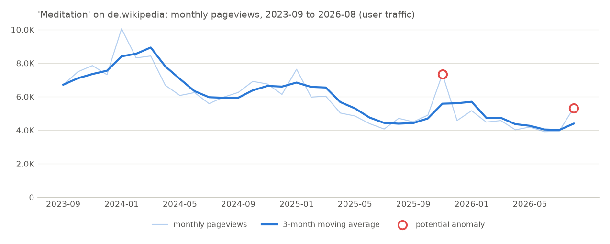
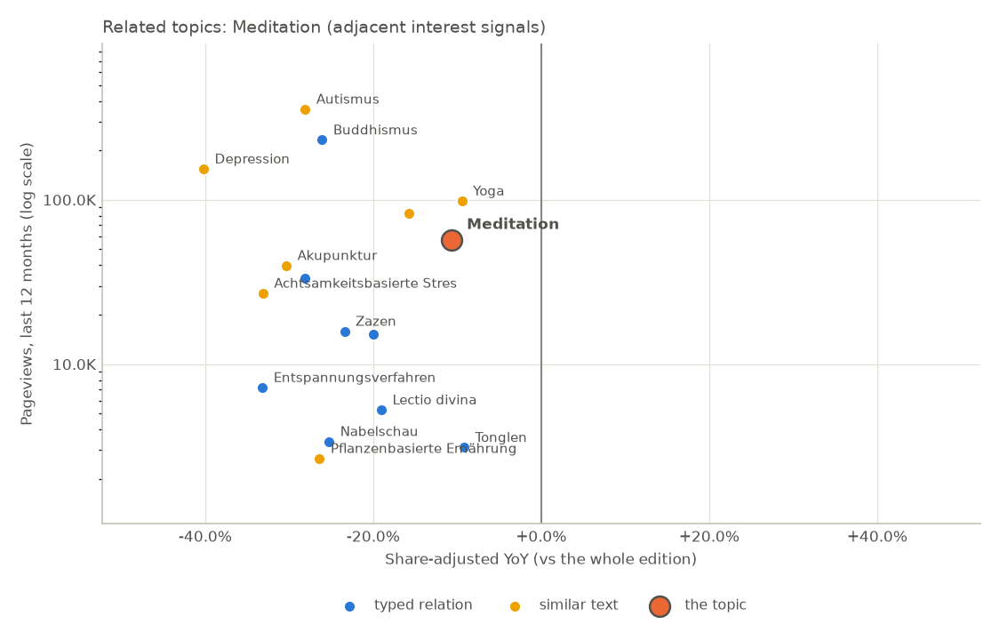

# Wikipedia Market Intelligence Report

## 1. Executive Decision Card

| | |
|---|---|
| Topic | Meditation |
| Language edition | de.wikipedia (a language edition, not a country) |
| Analysis period | 2023-09 to 2026-08 |
| Annual views (last 12 months) | 56,910 |
| Monthly average | 4,742 |
| Unique devices | n/a (unsupported: Wikimedia publishes unique devices per project (whole language edition) only, never per article.) |
| YoY | -17.2% |
| 3Y CAGR | -15.1% |
| Momentum | accelerating |
| Seasonality | peak January, trough July |
| Localization metrics | Wikipedia topic penetration: 6.7 per million edition views |
| Data quality | **HIGH** (full coverage, confident topic match, at least two years of data) |

### Decision signals

Five separate signals, each from one written rule. They are evidence for a human decision: they are not combined into a score and are not a recommendation to buy or invest.

| Signal | Reading | Evidence and rule |
|---|---|---|
| Market size (reader attention) | **low** | 56,910 views in the last 12 months; low is 12,000 to under 60,000. This is absolute: larger editions reach more readers. |
| Growth | **declining** | 3-year CAGR -15.1%; declining is under -3.0% a year. For context, de.wikipedia as a whole changed -7.3% year over year. |
| Momentum | **accelerating** | Last 3 months +3.1% against the 3 before them -10.1% (+13.2 points); above +5 points is accelerating, below -5 decelerating, otherwise stable. |
| Localization | n/a | not computed (Only defined across several editions: run `compare` with the languages to compare.) |
| Stability | **moderately seasonal** | The peak month, January, is 1.29x the average month; 2 flagged months out of 36, in 2 separate episodes. From 1.12x the topic is moderately seasonal, from 1.30x highly seasonal. |

### Key observations

- Annual pageviews (2025-09..2026-08) were 56.9K (about 4.7K a month).
- Pageviews decreased 17.2% year over year (2025-09..2026-08 vs 2024-09..2025-08).
- Three-year CAGR was -15.1% (vs 2022-09..2023-08).
- The last 3 months were +3.1% against the previous 3 months; momentum accelerating.
- 2 potential anomalies flagged; the largest was +43.3% against its baseline in 2025-11 (cause unknown). With the flagged months replaced by their expected values, the year-over-year change would be -22.7%.

## 2. Topic Definition

| | |
|---|---|
| Canonical topic | Meditation |
| Wikidata ID | Q108458 |
| Article used | Meditation (page ID 28837) |
| Resolution method | exact title |
| Resolution confidence | 0.98 |
| Language mappings | de: Meditation |
| Related topics | n/a |

## 3. Demand

| KPI | Value |
|---|---:|
| Annual views (last 12 months) | 56,910 |
| Monthly average | 4,742 |
| Daily average | 156 |
| Views in the requested period | 212,328 |
| Unique devices | n/a (unsupported: Wikimedia publishes unique devices per project (whole language edition) only, never per article.) |
| Views per unique device | n/a (unsupported: Wikimedia publishes unique devices per project (whole language edition) only, never per article.) |

## 4. Growth

| KPI | Value |
|---|---:|
| YoY (last 12M vs previous 12M) | -17.2% |
| 3Y CAGR | -15.1% |
| Last 3M vs previous 3M | +3.1% |
| Previous 3M vs the 3M before | -10.1% |
| Acceleration | +13.2 pp (accelerating) |
| Requested period vs previous equivalent period | -37.1% |

These are historical measurements, not forecasts. A growth chart is planned for a later milestone; the Demand chart shows the trend.

## 5. Seasonality

| KPI | Value |
|---|---:|
| Peak month | January |
| Trough month | July |
| Peak / average | 1.29 |
| Trough / average | 0.77 |
| Volatility (coefficient of variation) | 0.25 |

Basis: calendar-month means over 2023-09..2026-08 (3 observation(s) per month).

## 6. Language Opportunity

n/a (unavailable: Only defined across several editions: run `compare` with the languages to compare.)

## 7. Localization

| Metric | Value |
|---|---|
| Wikipedia topic penetration | 6.7 per million edition views |
| Topic affinity | n/a (unavailable: Only defined across several editions: run `compare` with the languages to compare.) |
| Country distribution | n/a (unsupported: Wikimedia publishes country-level pageviews per project (top-by-country), not per article, so a topic's country distribution cannot be measured.) |

A language edition is not a country: de.wikipedia is read wherever that language is read.

## 8. Topic Ecosystem

Related concepts found through typed Wikidata relations (broader, narrower, facets) and, separately, through text similarity. Each is an adjacent interest signal: where readers' attention sits around the topic, not a claim that it is a commercially adjacent product. Share-adjusted YoY compares each topic with its whole edition, whose views changed -7.3% year over year.

| Topic | Relationship | Annual views (last 12 months) | Size vs topic | YoY | Share-adjusted YoY | Signal |
|---|---|---:|---:|---:|---:|---|
| **Meditation** | — | 56,910 | 1× | -17.2% | — | — |
| Autismus | similar text | 356,236 | 6.26× | -33.4% | -28.1% | declining category |
| Buddhismus | facet of | 231,326 | 4.06× | -31.5% | -26.1% | larger category |
| Depression | similar text | 154,215 | 2.71× | -44.6% | -40.2% | declining category |
| Yoga | similar text | 98,454 | 1.73× | -16.1% | -9.4% | adjacent opportunity |
| Hatha Yoga | similar text | 83,112 | 1.46× | -22.0% | -15.8% | declining category |
| Akupunktur | similar text | 39,847 | 0.70× | -35.5% | -30.3% | declining category |
| Transzendentale Meditation | narrower | 33,415 | 0.59× | -33.4% | -28.1% | declining category |
| Achtsamkeit (Geistesgegenwart) | similar text | 33,406 | 0.59× | n/a | n/a | adjacent interest |
| Achtsamkeitsbasierte Stressreduktion | similar text | 27,008 | 0.47× | -38.0% | -33.1% | declining category |
| Zazen | narrower | 15,858 | 0.28× | -29.0% | -23.4% | declining category |
| Ensō | narrower | 15,132 | 0.27× | -25.8% | -20.0% | declining category |
| Entspannungsverfahren | broader | 7,210 | 0.13× | -38.1% | -33.2% | declining category |
| Lectio divina | narrower | 5,274 | 0.09× | -25.0% | -19.0% | declining category |
| Nabelschau | narrower | 3,385 | 0.06× | -30.7% | -25.2% | declining category |
| Tonglen | narrower | 3,116 | 0.05× | -15.9% | -9.2% | adjacent interest |
| Pflanzenbasierte Ernährung | similar text | 2,669 | 0.05× | -31.8% | -26.4% | declining category |
| Wirkungen der Meditation | similar text | 1,625 | 0.03× | n/a | n/a | adjacent interest |
| Daoistische Meditation | narrower | 799 | 0.01× | -31.3% | -25.9% | too small to judge |
| Pränatal-Yoga | similar text | 137 | 0.00× | -55.1% | -51.5% | too small to judge |
| Rosenkranzgeheimnisse | narrower | 133 | 0.00× | +23.1% | +32.9% | too small to judge |

Signals (descriptive, not recommendations):
- **larger category**: a broader concept with more views than the topic
- **emerging category**: gaining at least 10% relative to its edition
- **declining category**: losing at least 10% relative to its edition
- **adjacent opportunity**: at least as many views as the topic; its change is within 10 points of its edition's (it may still be falling)
- **adjacent interest**: fewer views than the topic; its change is within 10 points of its edition's (it may still be falling)
- **too small to judge**: under 100 views a month: any change is mostly noise

### Interest concentration

Share of the cluster's views held by its largest articles. The cluster is the topic plus its typed relations (11 articles); text-similar articles are left out.

| Top 1 | Top 5 | Top 10 | Top 20 |
|---:|---:|---:|---:|
| 62.1% | 94.7% | 100.0% | n/a (fewer than 20 articles) |

Largest article: Buddhismus (62.1% of the cluster's views).

High concentration means attention sits on a few concepts; low means it is spread across many. Neither is good or bad in itself.

> 1 broader concept(s) have no article in this edition and were skipped.
> 7 narrower concept(s) have no article in this edition and were skipped.
> 3 has facet concept(s) have no article in this edition and were skipped.
> Text similarity can include unrelated articles that share vocabulary.

## 9. Anomalies

Months far from their expected value. Expected = the median of the 6 months before and after, times the usual seasonal factor for that calendar month (from other years), so recurring seasonal peaks are not flagged. Flagged when the robust z-score exceeds 3.5 and the gap is at least 25.0%. Causes are not investigated.

| Month | Actual | Expected (baseline) | Change vs baseline | Robust z | Severity |
|---|---:|---:|---:|---:|---|
| 2025-11 | 7,348 | 5,127 | +43.3% | 5.5 | medium |
| 2026-08 | 5,328 | 3,792 | +40.5% | 5.2 | medium, provisional (recent month: the next data can change it) |

- Potential anomaly detected: 2025-11 pageviews were 43.3% above baseline. Cause: unknown.
- Potential anomaly detected: 2026-08 pageviews were 40.5% above baseline. Cause: unknown.

YoY with flagged months replaced by their expected values: -22.7% (reported YoY: -17.2%).

## 10. Data Quality

| | |
|---|---|
| Source | Wikimedia Analytics API (https://wikimedia.org/api/rest_v1/metrics/pageviews/per-article), access=all-access, agent=user |
| Data retrieved | 2026-09-27T11:22:30+00:00 |
| Report generated | 2026-09-27T11:22:36+00:00 (software 0.1.0) |
| Coverage | 100.0% |
| Missing data | none |
| Topic resolution confidence | 0.98 |
| Unique devices available | no |
| Country data available | no |
| Project-level denominator available | yes |
| API errors | none |
| Quality level | **HIGH**: full coverage, confident topic match, at least two years of data |

Metrics not computed:

| Metric | Status | Reason |
|---|---|---|
| demand.unique_devices | unsupported | Wikimedia publishes unique devices per project (whole language edition) only, never per article. |
| demand.views_per_unique_device | unsupported | Wikimedia publishes unique devices per project (whole language edition) only, never per article. |
| localization.country_distribution | unsupported | Wikimedia publishes country-level pageviews per project (top-by-country), not per article, so a topic's country distribution cannot be measured. |
| localization.topic_share | unavailable | Only defined across several editions: run `compare` with the languages to compare. |
| localization.topic_affinity | unavailable | Only defined across several editions: run `compare` with the languages to compare. |
| signals.localization | unavailable | Only defined across several editions: run `compare` with the languages to compare. |

Raw responses: `data/raw/wikimedia/pageviews-per-article/20260927T112230_2b682df09582.json`, `data/raw/wikimedia/pageviews-aggregate/20260927T112230_c49dec8c1d36.json`

## 11. Business Implications

### What the data supports

- Annual pageviews (2025-09..2026-08) were 56.9K (about 4.7K a month).
- Pageviews decreased 17.2% year over year (2025-09..2026-08 vs 2024-09..2025-08).
- Three-year CAGR was -15.1% (vs 2022-09..2023-08).
- The last 3 months were +3.1% against the previous 3 months; momentum accelerating.
- 2 potential anomalies flagged; the largest was +43.3% against its baseline in 2025-11 (cause unknown). With the flagged months replaced by their expected values, the year-over-year change would be -22.7%.
- These figures describe reader attention to one Wikipedia article in de.wikipedia.

### What the data does NOT establish

- Revenue, market size (TAM) or willingness to pay: pageviews measure attention, not purchasing.
- Product-market fit, or that a product on this topic would succeed.
- Causes of any change: the data shows that traffic moved, not why.
- Country-level demand: de.wikipedia readers are not one country's population.
- That readers of related articles, or of other language editions, share this trend.

### Questions requiring further validation

- Does search volume (e.g. Google Trends) show the same direction in this language?
- Is there App Store / Google Play demand for products on this topic in this language?
- What do competitors in this category earn, and how large is the addressable market?
- Will people pay? What do customer interviews and landing-page conversion rates show?
- What would customer acquisition cost, retention and monetization look like?