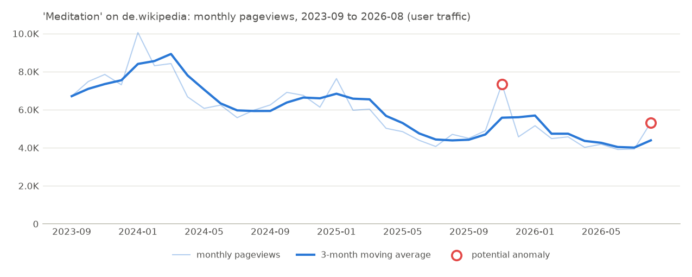

# Wikipedia Market Intelligence Report

## 1. Executive Decision Card

| | |
|---|---|
| Topic | Meditation |
| Language edition | de.wikipedia (a language edition, not a country) |
| Analysis period | 2023-09 to 2026-08 |
| Annual views (last 12 months) | 56,910 |
| Monthly average | 4,742 |
| Unique devices | n/a (unsupported: Wikimedia publishes unique devices per project (whole language edition) only, never per article.) |
| YoY | -17.2% |
| 3Y CAGR | -15.1% |
| Momentum | accelerating |
| Seasonality | peak January, trough July |
| Localization metrics | Wikipedia topic penetration: 6.7 per million edition views |
| Data quality | **HIGH** (full coverage, confident topic match, at least two years of data) |

### Key observations

- Annual pageviews (2025-09..2026-08) were 56.9K (about 4.7K a month).
- Pageviews decreased 17.2% year over year (2025-09..2026-08 vs 2024-09..2025-08).
- Three-year CAGR was -15.1% (vs 2022-09..2023-08).
- The last 3 months were +3.1% against the previous 3 months; momentum accelerating.
- 2 potential anomalies flagged; the largest was +43.3% against its baseline in 2025-11 (cause unknown). With the flagged months replaced by their expected values, the year-over-year change would be -22.7%.

## 2. Topic Definition

| | |
|---|---|
| Canonical topic | Meditation |
| Wikidata ID | Q108458 |
| Article used | Meditation (page ID 28837) |
| Resolution method | exact title |
| Resolution confidence | 0.98 |
| Language mappings | de: Meditation |
| Related topics | n/a (not implemented: Topic ecosystem analysis is planned for a later milestone.) |

## 3. Demand

| KPI | Value |
|---|---:|
| Annual views (last 12 months) | 56,910 |
| Monthly average | 4,742 |
| Daily average | 156 |
| Views in the requested period | 212,328 |
| Unique devices | n/a (unsupported: Wikimedia publishes unique devices per project (whole language edition) only, never per article.) |
| Views per unique device | n/a (unsupported: Wikimedia publishes unique devices per project (whole language edition) only, never per article.) |

## 4. Growth

| KPI | Value |
|---|---:|
| YoY (last 12M vs previous 12M) | -17.2% |
| 3Y CAGR | -15.1% |
| Last 3M vs previous 3M | +3.1% |
| Previous 3M vs the 3M before | -10.1% |
| Acceleration | +13.2 pp (accelerating) |
| Requested period vs previous equivalent period | -37.1% |

These are historical measurements, not forecasts. A growth chart is planned for a later milestone; the Demand chart shows the trend.

## 5. Seasonality

| KPI | Value |
|---|---:|
| Peak month | January |
| Trough month | July |
| Peak / average | 1.29 |
| Trough / average | 0.77 |
| Volatility (coefficient of variation) | 0.25 |

Basis: calendar-month means over 2023-09..2026-08 (3 observation(s) per month).

## 6. Language Opportunity

n/a (unavailable: Only defined across several editions: run `compare` with the languages to compare.)

## 7. Localization

| Metric | Value |
|---|---|
| Wikipedia topic penetration | 6.7 per million edition views |
| Topic affinity | n/a (unavailable: Only defined across several editions: run `compare` with the languages to compare.) |
| Country distribution | n/a (unsupported: Wikimedia publishes country-level pageviews per project (top-by-country), not per article, so a topic's country distribution cannot be measured.) |

A language edition is not a country: de.wikipedia is read wherever that language is read.

## 8. Topic Ecosystem

n/a (not implemented: Topic ecosystem analysis is planned for a later milestone.)

## 9. Anomalies

Months far from their expected value. Expected = the median of the 6 months before and after, times the usual seasonal factor for that calendar month (from other years), so recurring seasonal peaks are not flagged. Flagged when the robust z-score exceeds 3.5 and the gap is at least 25.0%. Causes are not investigated.

| Month | Actual | Expected (baseline) | Change vs baseline | Robust z | Severity |
|---|---:|---:|---:|---:|---|
| 2025-11 | 7,348 | 5,127 | +43.3% | 5.5 | medium |
| 2026-08 | 5,328 | 3,792 | +40.5% | 5.2 | medium, provisional (recent month: the next data can change it) |

- Potential anomaly detected: 2025-11 pageviews were 43.3% above baseline. Cause: unknown.
- Potential anomaly detected: 2026-08 pageviews were 40.5% above baseline. Cause: unknown.

YoY with flagged months replaced by their expected values: -22.7% (reported YoY: -17.2%).

## 10. Data Quality

| | |
|---|---|
| Source | Wikimedia Analytics API (https://wikimedia.org/api/rest_v1/metrics/pageviews/per-article), access=all-access, agent=user |
| Data retrieved | 2026-09-27T09:35:05+00:00 |
| Report generated | 2026-09-27T10:49:11+00:00 (software 0.1.0) |
| Coverage | 100.0% |
| Missing data | none |
| Topic resolution confidence | 0.98 |
| Unique devices available | no |
| Country data available | no |
| Project-level denominator available | yes |
| API errors | none |
| Quality level | **HIGH**: full coverage, confident topic match, at least two years of data |

Metrics not computed:

| Metric | Status | Reason |
|---|---|---|
| demand.unique_devices | unsupported | Wikimedia publishes unique devices per project (whole language edition) only, never per article. |
| demand.views_per_unique_device | unsupported | Wikimedia publishes unique devices per project (whole language edition) only, never per article. |
| localization.country_distribution | unsupported | Wikimedia publishes country-level pageviews per project (top-by-country), not per article, so a topic's country distribution cannot be measured. |
| localization.topic_share | unavailable | Only defined across several editions: run `compare` with the languages to compare. |
| localization.topic_affinity | unavailable | Only defined across several editions: run `compare` with the languages to compare. |
| ecosystem.related_topics | not implemented | Topic ecosystem analysis is planned for a later milestone. |
| signals | not implemented | Decision signals are planned for a later milestone. |

Raw responses: `/private/tmp/claude-502/wmi/data/raw/wikimedia/pageviews-per-article/20260927T093505_2b682df09582.json`, `/private/tmp/claude-502/wmi/data/raw/wikimedia/pageviews-aggregate/20260927T102206_c49dec8c1d36.json`

## 11. Business Implications

### What the data supports

- Annual pageviews (2025-09..2026-08) were 56.9K (about 4.7K a month).
- Pageviews decreased 17.2% year over year (2025-09..2026-08 vs 2024-09..2025-08).
- Three-year CAGR was -15.1% (vs 2022-09..2023-08).
- The last 3 months were +3.1% against the previous 3 months; momentum accelerating.
- 2 potential anomalies flagged; the largest was +43.3% against its baseline in 2025-11 (cause unknown). With the flagged months replaced by their expected values, the year-over-year change would be -22.7%.
- These figures describe reader attention to one Wikipedia article in de.wikipedia.

### What the data does NOT establish

- Revenue, market size (TAM) or willingness to pay: pageviews measure attention, not purchasing.
- Product-market fit, or that a product on this topic would succeed.
- Causes of any change: the data shows that traffic moved, not why.
- Country-level demand: de.wikipedia readers are not one country's population.
- That readers of related articles, or of other language editions, share this trend.

### Questions requiring further validation

- Does search volume (e.g. Google Trends) show the same direction in this language?
- Is there App Store / Google Play demand for products on this topic in this language?
- What do competitors in this category earn, and how large is the addressable market?
- Will people pay? What do customer interviews and landing-page conversion rates show?
- What would customer acquisition cost, retention and monetization look like?